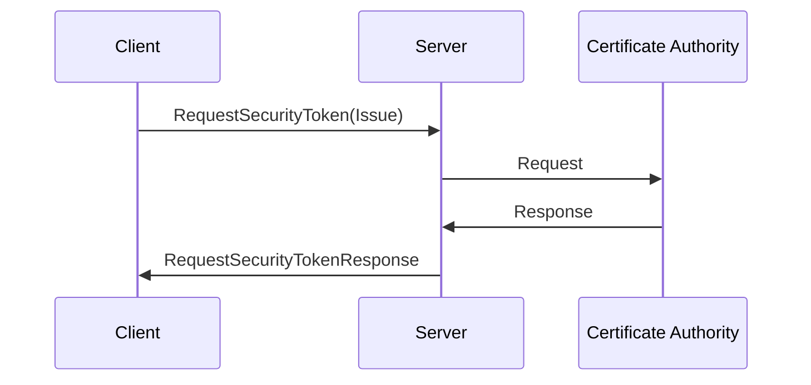
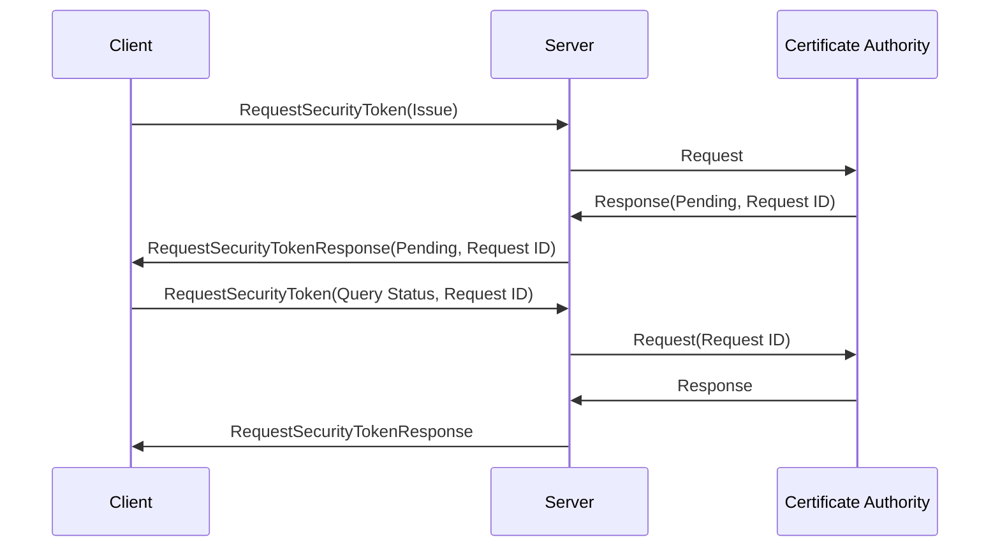
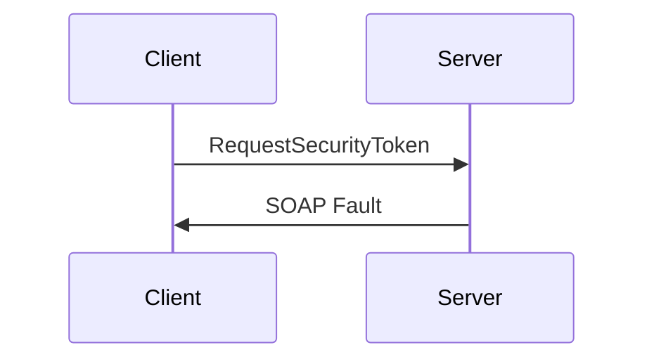

# `wstep-rs`

`wstep-rs` is a Rust implementation of the [MS-WSTEP] WS-Trust X.509v3 Token Enrollment Extensions protocol:

> Specifies the WS-Trust X.509v3 Token Enrollment Extensions, also known as WSTEP.
> The protocol specification defines the message formats and server behavior for the purposes of certificate enrollment.

[MS-WSTEP]: https://learn.microsoft.com/en-us/openspecs/windows_protocols/ms-wstep/4766a85d-0d18-4fa1-a51f-e5cb98b752ea

## Introduction

MS-WSTEP is a SOAP protocol framework for the following common certificate authority (CA) operations:

- Requesting and retrieving a certificate
- Renewing a certificate
- Retrieving the status of a pending certificate request

The following protocol stack diagram illustrates the relationship between MS-WSTEP and other protocols.
To learn more, see [1.4 Relationship to Other Protocols](https://learn.microsoft.com/en-us/openspecs/windows_protocols/ms-wstep/0910dccd-583e-4e7b-afc6-8bb82aadd1f1):

| Protocol    | Stack Layer       |
| ----------- | ----------------- |
|             | This Protocol     |
| WSTEP       | ⬇                 |
| WS-Trust    | ⬇                 |
|             | Industry Standard |
| WS-Security | ⬇                 |
| SOAP        | ⬇                 |
| HTTPS       | ⬇                 |
| TCP         | ⬇                 |
| IP          | ⬇                 |

From "[What is Active Directory Certificate Services?](https://learn.microsoft.com/en-us/windows-server/identity/ad-cs/active-directory-certificate-services-overview)":

> Active Directory Certificate Services (AD CS) is a Windows Server role for issuing and managing public key infrastructure (PKI) certificates used in secure communication and authentication protocols.

Programmatically interacting with AD CS can be useful for automation—for example, to automate the enrollment and renewal of certificates.
These interactions are facilitated by protocols published and maintained by Microsoft. `adcs-rs` implements two of these protocols in Rust:

- MS-WCCE: Windows Client Certificate Enrollment Protocol
- MS-WSTEP (this crate): WS-Trust X.509v3 Token Enrollment Extensions Protocol

These protocols—as well as the `adcs-rs` crates that implement them—are composable.
For example, if the Certificate Enrollment Web Service (CES) has been set up, certificate enrollment may occur over HTTPS with the following method:

- MS-WCCE is used to create certificate requests
- MS-WSTEP (this crate) is used to send these certificate requests, query enrollment status, and retrieve enrolled certificates

```rust ignore
use wcce_rs::{
    attributes::EnrollmentNameValuePair,
    cms::{CmsCertificateRequest, CmsCertificateRequestBuildError},
    extensions::CertificateTemplate,
    pkcs10::{CertificateRequest, CertificateRequestBuildError, ExtendedKeyUsage, KeyUsage},
    signing::{SigningCertificate, SigningKey},
};
use wstep_rs::{
    request::{WstepRequest, WstepRequestSerializationError},
    response::{WstepResponse, WstepResponseError},
};

// ...

// Create a PKCS #10 certificate signing request (CSR)
let csr = CertificateRequest::builder()
    .add_key_usage(KeyUsage::DigitalSignature)
    .add_extended_key_usage(ExtendedKeyUsage::ClientAuth)
    .add_extended_key_usage(ExtendedKeyUsage::SmartCardLogon)
    .add_extension(&CertificateTemplate {
        template_oid,
        major_version,
        minor_version,
    })
    .build(&csr_signing_key)?;

// Wrap the CSR in a cryptographic message syntax (CMS) certificate request to add additional request parameters
let cms = CmsCertificateRequest::builder()
    .add_signed_name_value_pair(&EnrollmentNameValuePair::RequesterName {
        domain_account: &requester_name,
    })
    .build(&csr, &csr_signing_key, &csr_signing_cert)?;

/// Submit the CMS CSR over HTTP using SOAP
let soap = WstepRequest::new_issue_x509v3(
    &cms,
    &format!("urn:uuid:{}", &Uuid::new_v4()),
    Some(&adcs_ces_uri),
    None,
)
.serialize_request()?;

let request = http_client
    .post(&adcs_ces_uri)
    .header(CONTENT_TYPE, WstepRequest::SOAP_CONTENT_TYPE)
    .body(soap)
    .build()?;

// ...

let parsed_response = WstepResponse::new_from_soap_xml_str(&response_body)?;
match parsed_response.requested_token() {
    // Do something with the requested security token (certificate)
    Ok(token) => todo!(),
    // Inspect the fault returned by the server
    Err(fault) => todo!(),
}
```

## Common Request Flows

In the diagrams below, this crate facilitates messages between the client and server entities.
For more information about common request flows, see the [MS-WSTEP protocol overview](https://learn.microsoft.com/en-us/openspecs/windows_protocols/ms-wstep/ac55b8cc-9ade-4982-b135-991d574ade74).

### Certificate Enrollment

This is the most common request flow.



### Pending Certificate Enrollment

Some certificate requests require manual approval by an administrator.
The MS-WSTEP protocol supports querying the status of pending certificate requests.



### Certificate Renewal Request

Renewing a certificate is similar to issuing a new one.


### Server Fault

Certificate requests can be rejected or fail for various reasons.



## Usage

Add `wstep-rs` to your dependencies in Cargo.toml. This crate comes with no additional features to enable:

```toml
[dependencies]
wstep-rs = "0.1.3"
```

## History

These libraries were developed by the [D. E. Shaw group](https://www.deshaw.com/) for secure, high-performance infrastructure engineering.

<p align="center">
    <a href="https://www.deshaw.com">
       
    </a>
</p>

## License

This project is released under a [BSD-3-Clause license](LICENSE.txt).

We love contributions! Before you can contribute, please sign and submit this [Contributor License Agreement (CLA)](https://www.deshaw.com/oss/cla).
This CLA is in place to protect all users of this project.
